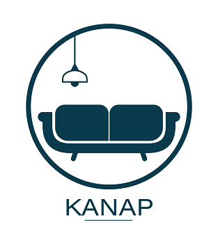

- Projet 5 du parcours "Développeur Web" d'OpenClassrooms :
- "Construisez un site e-commerce en JavaScript".

- Nous avions, pour base de travail, le code du back-end et la partie statique du front-end. Vous trouverez le repo initial [ici](https://github.com/OpenClassrooms-Student-Center/P5-Dev-Web-Kanap). 
- Nous devions unifier les travaux déjà réalisés par l'équipe en intégrant dynamiquement les éléments de l'API dans les différentes pages web avec JavaScript. 
- L'utilisation de tout framework ou librairie JavaScript était interdite pour ce projet. Seul le code JavaScript pur était autorisé.
- Nous devions également mettre en place un plan de test d'acceptation.
 
## Spécifications fonctionnelles et techniques 
### Architecture générale
L’application web devait se composer de 4 pages :
- Une page d’accueil montrant (de manière dynamique) tous les articles disponibles à
la vente.
- Une page “produit” qui affiche (de manière dynamique) les détails du produit sur
lequel l'utilisateur a cliqué depuis la page d’accueil. Depuis cette page, l’utilisateur
devait pouvoir sélectionner une quantité, une couleur, et ajouter le produit à son panier.
- Une page “panier”. Celle-ci devant contenir plusieurs parties :
Un résumé des produits dans le panier, le prix total et la possibilité de
modifier la quantité d’un produit sélectionné ou bien de supprimer celui-ci.
Un formulaire permettant de passer une commande. Les données du
formulaire devaient être correctes et bien formatées avant d'être renvoyées au
back-end. Par exemple, pas de chiffre dans un champ prénom.
- Une page “confirmation” : un message de confirmation de commande, remerciant l'utilisateur pour sa
commande, et indiquant l'identifiant de commande envoyé par l’API.

### Informations complémentaires
- La page d’accueil :
Cette page devait présenter l’ensemble des produits retournés par l’API.
Pour chaque produit, il fallait afficher l’image de celui-ci, ainsi que son nom et le début de
sa description.
En cliquant sur le produit, l’utilisateur devait être redirigé sur la page du produit pour consulter
celui-ci plus en détail.
- La page Produit :
Cette page devait présenter un seul produit ; elle contient un menu déroulant permettant à l'utilisateur
de choisir une option de personnalisation, ainsi qu’un input pour saisir la quantité. Ces
éléments devaient être pris en compte dans le panier.
- La page Panier :
Sur cette page, l’utilisateur devait pouvoir modifier la quantité d’un produit de son panier ; à ce
moment, le total du panier devait bien se mettre à jour.
L’utilisateur devait aussi avoir la possibilité de supprimer un produit de son panier, le produit devait
donc disparaître de la page.
Les inputs des utilisateurs devaient être analysés et validés pour vérifier le format et le type
de données avant l’envoi à l’API. Par exemple, il n'aurait pas été recevable d’accepter un
prénom contenant des chiffres, ou une adresse e-mail ne contenant pas de symbole “@”. En
cas de problème de saisie, un message d’erreur devait être affiché en dessous du champ
correspondant.
Il fallait prêter attention à ne pas stocker le prix des articles en local. Les données stockées en local ne
sont pas sécurisées et l’utilisateur pourrait alors modifier le prix lui-même.
- La page Confirmation :
Sur cette page, l'utilisateur devait voir s’afficher son numéro de commande. Il fallait veiller à
ce que ce numéro ne soit stocké nulle part.
- Le code source :
Celui-ci devait être indenté et utiliser des commentaires en début de chaque fonction pour
décrire son rôle. Il devait également être découpé en plusieurs fonctions réutilisables
(nommées). Une fonction devait être courte et répondre à un besoin précis. Il ne fallait pas
avoir de longues fonctions qui viendraient répondre à plusieurs besoins à la fois. Exemple : il
n'aurait pas été accepté de mettre une seule et unique fonction en place pour collecter, traiter
et envoyer des données.
- API :
Concernant l’API, des promesses devaient être utilisées pour éviter les callbacks. Il était
possible d’utiliser des solutions alternatives, comme fetch, celle-ci englobant la promesse.
L’API n’était que dans sa première version. La requête post qu’il fallait formuler
pour passer une commande ne prenait pas encore en considération la quantité ni la couleur
des produits achetés.

### Fonctionnement du panier
- Dans le panier, les produits devaient toujours apparaître de manière regroupée par modèle et
par couleur.
- Si un produit était ajouté dans le panier à plusieurs reprises, avec la même couleur, celui-ci
ne devait apparaître qu’une seule fois, mais avec le nombre d’exemplaires ajusté.
- Si un produit était ajouté dans le panier à plusieurs reprises, mais avec des couleurs
différentes, il devait apparaître en deux lignes distinctes avec la couleur et la quantité
correspondantes indiquées à chaque fois.

### Planification de tests
- Nous devions planifier une suite de tests d’acceptation pour couvrir l’ensemble des fonctionnalités listées
dans ce document (spécifications fonctionnelles et techniques Kanap).

## Lancer le projet (traduction des consignes du [repo initial](https://github.com/OpenClassrooms-Student-Center/P5-Dev-Web-Kanap))
- Vous devez avoir Node et `npm` installés localement sur votre machine.
- Clonez ce repo ; 
- Dans le terminal, placez-vous dans le dossier "back", puis tapez `npm install`; 
- Ensuite, tapez `node server`. 
- Le serveur devrait se lancer dans votre navigateur sur le port `3000`. Si le serveur tourne sur un autre port, la console vous indiquera par exemple `Listening on port 3001`.

